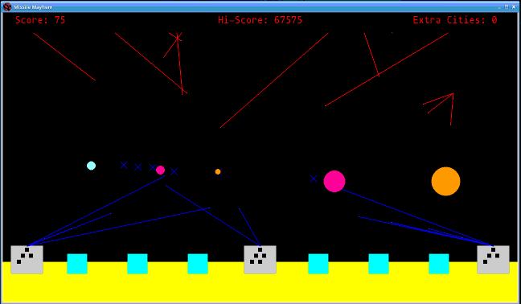

# Missile Mayhem
A Missile Command clone made with Pygame

The game loosely resembles the arcade game [Missile Command](https://en.wikipedia.org/wiki/Missile_Command)

# Game Play
On load the user is prompted to press the `space bar` to begin play. If the users waits for several seconds, a small demo of game play will begin, which can be exited by pressing `space`.

The game consists of enemy missile attacks that com in 'waves'. Each wave starts with 4 incoming missiles, with additional enemy missiles being fired approximately every 2 seconds. Waves last around 30 seconds. The is a roughly 25% chance that an incoming missile can split into 3 additional missile attack, targeting towers and cities randomly. Defend your towers and cities! 

Waves come in sets of 2, where each set has a consistent incoming attack speed. Every third wave the incoming attack speed increases until wave 19, after which all subsequent waves will have the maximum attack speed. After wave 20, the colors recycle ,but attack speeds and bonus point remain fixed.

Players receive bonus points for each remaining city. Each wave set has an associated bonus point multiple, starting at 1 and increasing to 6 at wave 11. A bonus/extra city is rewarded for every 7000 points scored.

Play continues until all cities have been destroyed and the player has no extra cities banked up. If you get a new high score, you will a notice at the end of game play and the ‘Hi-Score’ will be updated, so try to beat your high score!

### Controls 
Use the mouse to potion the targeting reticle on the screen and press `A`, `S`, or `D` to fire an anti-missile from the corresponding tower (from left to right)

## Running the app
Dependencies:
- python >= 3.8 
- pygame >= 2.1 
- numpy >= 1.15 
      
Once the dependencies are met, you can enter `python run.py` or `python -m app` on the command line from the root directory to start the game
